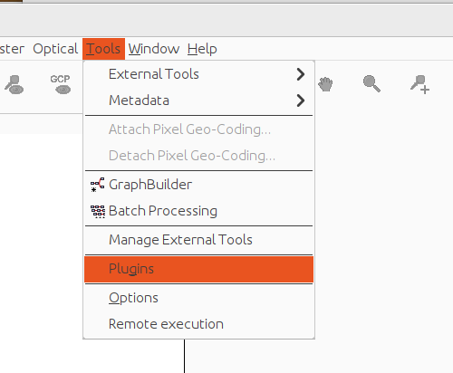
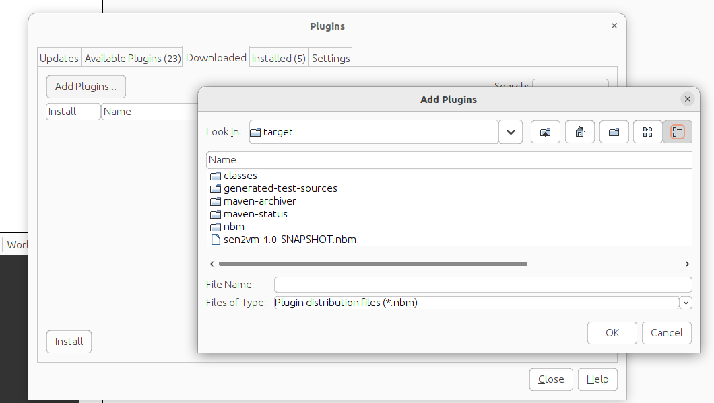
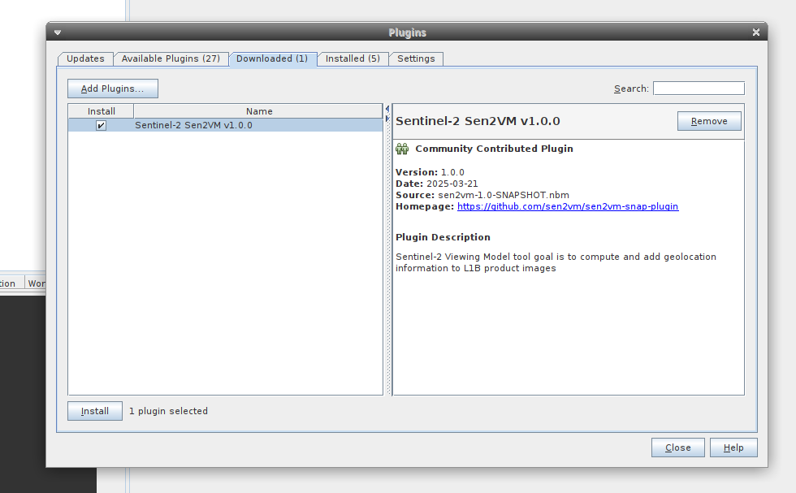
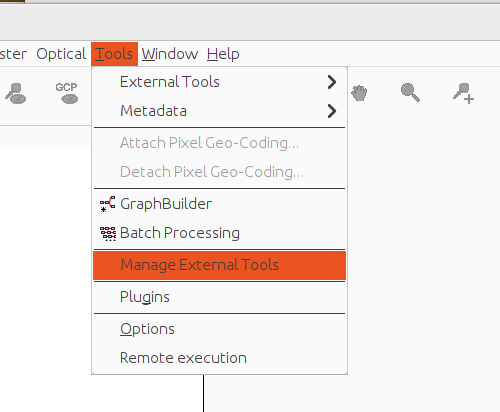
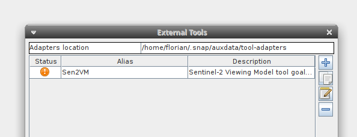
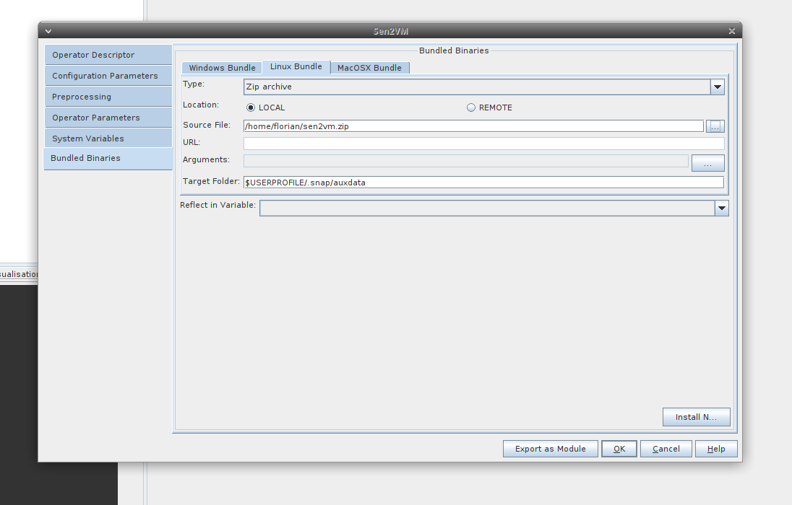
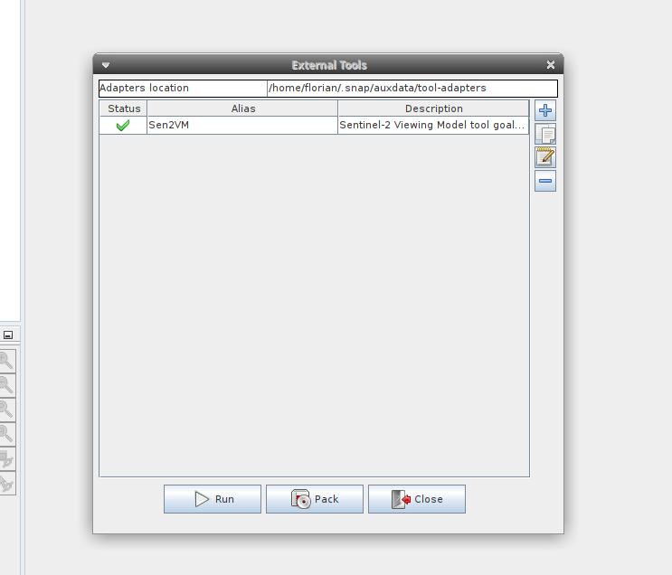

# Sen2VM-snap-plugin

Sen2VM SNAP plugin that calls the Sen2VM-Core standalone jar. For more details about the Sen2VM-Core, please refer to the following : https://github.com/sen2vm/sen2vm-core.

### *Prerequisites*

* build sen2vm-core
* create zip archive with the following structure

sen2vm.zip 

  src/main/resources/orekit-data/ 

  sen2vm-core/

  sen2vm-core/sen2vm-core-0.0.1-SNAPSHOT.jar 

  sen2vm-core/configuration_example.json 

  sen2vm-core/params.json 

### Build from sources

* Build with maven and Java >11 :

  ``mvn clean install``

###  SNAP installation

The bundle installation is not provided for now. You can distribute the archive with Python http.server to serve the zip file on the default SNAP URL:

``	python3 -m http.server 8000 ``

Otherwise, you can choose local installation in the SNAP menu bundle installation.

* Install plugin from snap menu: **Tools → Plugins** 

 

 

 

Continue by  **Downloaded → Add Plugins** and search for the nbm file in :

sen2vm-snap-plugin/target/sen2vm-snap-plugin-1.0-SNAPSHOT.nbm 

 

At the end of the plugin installation, choose to restart SNAP to apply the changes.

At this stage, only the plugin is installed. You need to install the installation bundle -> sen2vm.zip. At the first execution of the plugin, the installation bundle is proposed to the user. Otherwise, it is possible to install the bundle after the restart in the menu **Tools > Manage External Tools**

 

 

Then, double click on  **Sen2VM**

Continue to **Bundled Binaries** and proceed to **Download and Install Now** . Then, click OK and exit from the **Manage External Tools**.

 

### Using

The sen2vm-snap-plugin is located in **Optical>Geometric>Sen2VM**

Console output can be enabled via Display execution output.

There are two ways to set the parameters. 

* Specify the path to configuration files: Configuration file and Parameters File. These parameters override all others. Do not set them if you want to use the others. 
* Set the parameters and choose the detectors and bands to process

